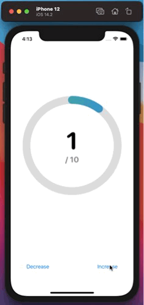

# CircularProgress

SwiftUI package that creates an animated circular progress bar

### Installation: It requires at least iOS 13, iPadOS 13, macOS 10.15  and Xcode 11!

In Xcode go to `File -> Swift Packages -> Add Package Dependency` and paste in the repo's url: `https://github.com/ArnavMotwani/CircularProgressSwiftUI.git` then either select a version or the main branch (I will update the main branch more frequently with minor changes, while the version will only increase with significant changes)

## Usage:

Import the package into the file with  `import CircularProgress`

### Example:
Here is how the default view, with no customizations, can be implemented

<p float="center">
  
</p>

```swift
import SwiftUI
import CircularProgress

struct ContentView: View {
    @State var count = 0
    let total = 10
    var progress: CGFloat{
        return CGFloat(count)/CGFloat(total)
    }
    var body: some View {
        VStack {
            CircularProgressView(count: count, total: total, progress: progress)
                .padding(50)
            HStack{
                Button("Decrease", action: {self.count -= 1})
                Spacer()
                Button("Increase", action: {self.count += 1})
            }
            .padding(50)
        }
    }
}

```

## Customizations:

| parameter      | optional? | type              | description                                                                   | default                                                                                                    |
|----------------|-----------|-------------------|-------------------------------------------------------------------------------|------------------------------------------------------------------------------------------------------------|
| count          | required  | Int               | Current value (larger text in the centre)                                     | -                                                                                                          |
| total          | required  | Int               | Total value (smaller text in the centre)                                      | -                                                                                                          |
| progress       | required  | CGFloat           | Progress of the bar                                                           | -                                                                                                          |
| fontOne        | optional  | Font              | Font of larger text in the centre                                             | Font.system(size: 75, weight: .bold, design: .rounded)                                                     |
| fontTwo        | optional  | Font              | Font of smaller text in the centre                                            | Font.system(size: 25, weight: .bold, design: .rounded)                                                     |
| colorOne       | optional  | Color             | Color of larger text in the centre                                            | Color.primary                                                                                              |
| colorTwo       | optional  | Color             | Color of smaller text in the centre                                           | Color.gray                                                                                                 |
| fill           | optional  | Color or Gradient | Fill of the progress bar                                                      | LinearGradient(gradient: Gradient(colors: [Color.green, Color.blue]), startPoint: .top, endPoint: .bottom) |
| lineWidth      | optional  | CGFloat           | Width of the progress bar                                                     | 25.0                                                                                                       |
| lineCap        | optional  | CGLineCap         | The line cap at the end of the progress bar                                   | CGLineCap.round                                                                                            |
| showText       | optional  | Bool              | Choose whether the text at the centre is displayed or not                     | true                                                                                                       |
| showBottomText | optional  | Bool              | Choose whether the bottom text in the centre is visible (if showText is true) | true                                                                                                       |
### Examples

#### fontOne
<p float="center">
  
</p>

```swift
CircularProgressView(count: count, total: total, progress: progress, fontOne: Font.title.bold())
```
---
#### fontTwo
<p float="center">
  
</p>

```swift
CircularProgressView(count: count, total: total, progress: progress, fontTwo: Font.title2)
```
---
#### colorOne
<p float="center">
  
</p>

```swift
CircularProgressView(count: count, total: total, progress: progress, colorOne: Color.blue)
```
---
#### colorTwo
<p float="center">
  
</p>

```swift
CircularProgressView(count: count, total: total, progress: progress, colorTwo: Color.blue)
```
---
#### fill
<p float="center">
  
</p>

```swift
CircularProgressView(count: count, total: total, progress: progress, fill: LinearGradient(gradient: Gradient(colors: [Color.red, Color.blue]), startPoint: .leading, endPoint: .trailing))
```
---
#### lineWidth
<p float="center">
  
</p>

```swift
CircularProgressView(count: count, total: total, progress: progress, lineWidth: 50)
```
---
#### lineCap
<p float="center">
  
</p>

```swift
CircularProgressView(count: count, total: total, progress: progress, lineCap: CGLineCap.square)
```
---
#### showText
<p float="center">
  
</p>

```swift
CircularProgressView(count: count, total: total, progress: progress, showText: false)
```
---
#### showBottomText
<p float="center">
  
</p>

```swift
CircularProgressView(count: count, total: total, progress: progress, showBottomText: false)
}
```


